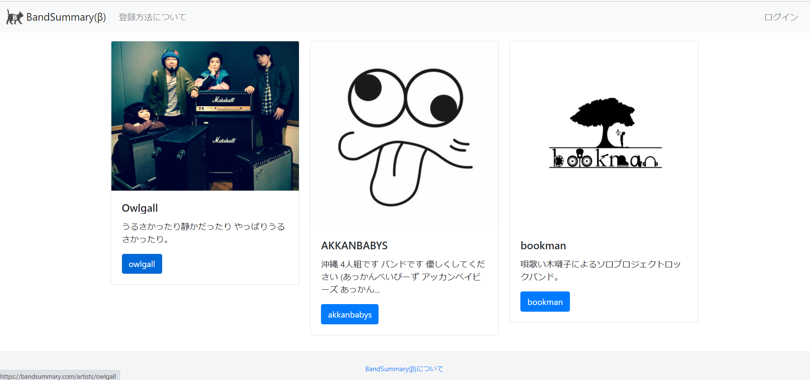
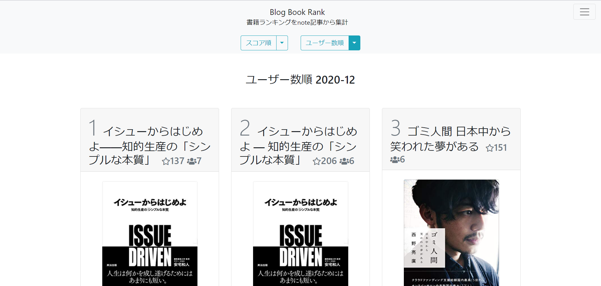
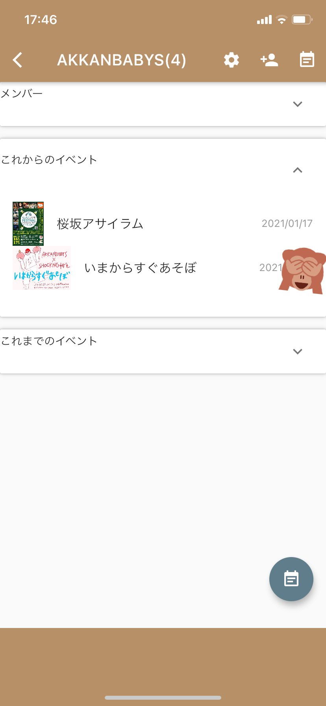

# Band Summary(β)
[https://bandsummary.com/](https://bandsummary.com/)

## どういうものか

ライブ情報を投稿管理でき、リンクを追加したらいい感じにまとめてくれるサービス  
リンクツリー＋バンドのライブ情報を投稿、管理なイメージ

## 開発経緯

（周りの）インディーズバンドでホームページがないバンドが多くて、どこを調べたらライブ情報が一覧で把握できるかわかりづらかった。  
ツイッター見ても、他の投稿で流れていて追っかけるのに時間がかかってる。  
ホームページを作るのは大変なので、簡単にpostできるサービスがあれば使ったもらえるかなと思い作成。  
また、2020年の目標をWEBアプリ開発（初めての個人開発）に置いていたため、身近な題材（自分自身バンドを組んでいるので）で取り組んでみました。

## 主な使用言語とか

Go,Beego(Goのwebフレームワークの一つ)  
Oracle always free, ATP

## 反省点

- どうせだからとoracle always freeでの完全無料稼働を目指して、OracleのATPに苦しんだこと。
- なんならアクセスがあるのに自動停止措置が取られる謎仕様のため、現在も苦しんでるところ。
- フレームワークがoracleに完全対応していなくて、結局フレームワーク側のソースを修正するに至ったこと。

## 学んだこと

### チャレンジしたいことはせめて三つ以内にすること

初めての個人開発、初めてのGolang、初めてのOracle SQL（＋ATP）、初めてのクラウド開発環境、自前のSNS連携にアカウント管理

特にクラウド開発環境は、どんなよわよわPCからでも開発し続けたいと思い、  
Oracleのクラウド上に開発環境を構築してcode-serverなりなんなりで達成したけれども、そもそも手持ちのノートPCのスペックは上々なため本当に必要ありませんでした。

# Blog Book Rank
[https://bookrank.ihmdevs.com/](https://bookrank.ihmdevs.com/)

## どういうものか

note記事を解析し、おすすめ本の中でAmazonのリンクが貼られているものを集計、ランキング化。

## 開発経緯

身近な人が本に関わる仕事をしているため、近しい何か作れないかなと思ったこと。  
個人開発のマネタイズを意識した際に[テック・ブック・ランク](https://www.techbookrank.com/)のようにアフィリエイトでチャリンチャリンできないかなと思ったため。  
AWSの勉強中だったためLamdaの無料枠で何かできないかなと思ったため。

## 主な使用言語とか

Go(速度が良いとのことで前作から引き続き)  
AWS Lambda, dynamodb

## 反省点

- 多様なランキングを出す際にはDynamodbは不向き。
- 前処理、後処理のためにLambdaを回すはめに。
- 集計、ランキング化をしたはいいが宣伝が不足しまくっている。

## 学んだこと

ドメインはサービスごとに作らない、サブドメインで対応する。

Amazonの情報を正規表現で取得しているけれど、ゴミが多すぎて時々正規表現をメンテナンスしています。  
noteのAPI情報で引っこ抜けるっぽいところを、自前でやった方がカッケーじゃんって思ってしまったのが不運の始まりでした。  
本当にゴミが多い。URLのルールも探してもなさげでした。

ランキングに載った投稿に自動で「いいね」つけるくらいはしたいなと思ってます。  
電子書籍版と実物版が合算されていないのをどうにかしたい（収益が見込めたらやりたい、今のところとても面倒そう）

# Tickets Band
[https://imikio.github.io/TicketsBand/](https://imikio.github.io/TicketsBand/)

 

## どういうものか

スマホアプリ  
イベントの予約状況などを複数人（グループ）で管理、把握。秒で反映。

## 開発経緯

flutterに出会ってしまった。

スマホアプリが作りたかった。  
glideで所属バンド用に、イベントごとの予約を登録、把握できる同等のアプリを作成していたが、glideが無料枠で同時ログインできない仕様になったため頑張ってみました。  
（身近な）他のバンドも予約状況の共有と把握で結構困っているっぽかったため。

## 主な使用言語とか

Flutter,Dart  
Firebase

## 反省点

- 逃げてきたUI/UXとの闘いになった。（現在もそのさなか）

2020/12/31 今まだバージョンアップをしつつなので、反省しては開発って感じでいます。

## 学んだこと

Githubでのコード管理とBitrizeでのCIで、管理系にも本腰を入れてみて、新たな世界が開けた気がします。  
Flutter,Firebaseで世界が開けた気がします、BandSummaryで自前で実装、管理していたものがこんなにも簡単に…。

あと、Macを持っていないため、どこまでMacなしでできるかを試してみてたらついにはリリースまで行けました。  
flutterとbitrizeに感謝です。
